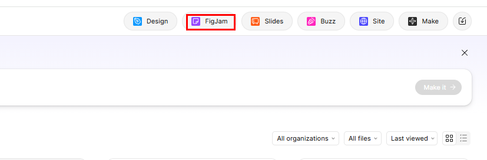
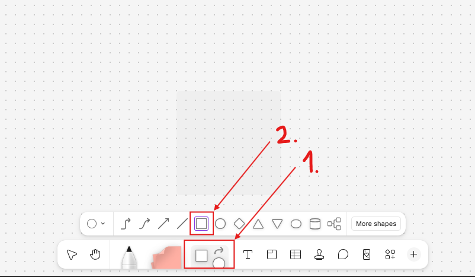
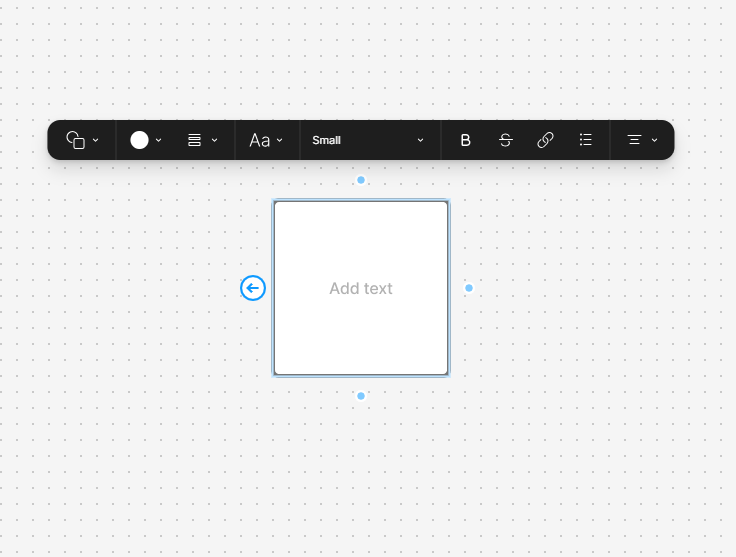
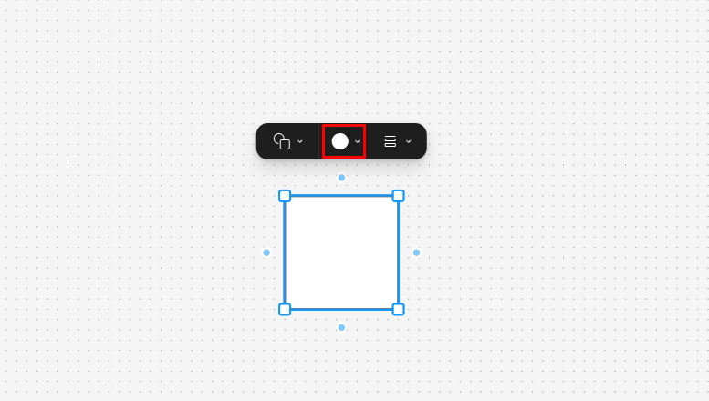
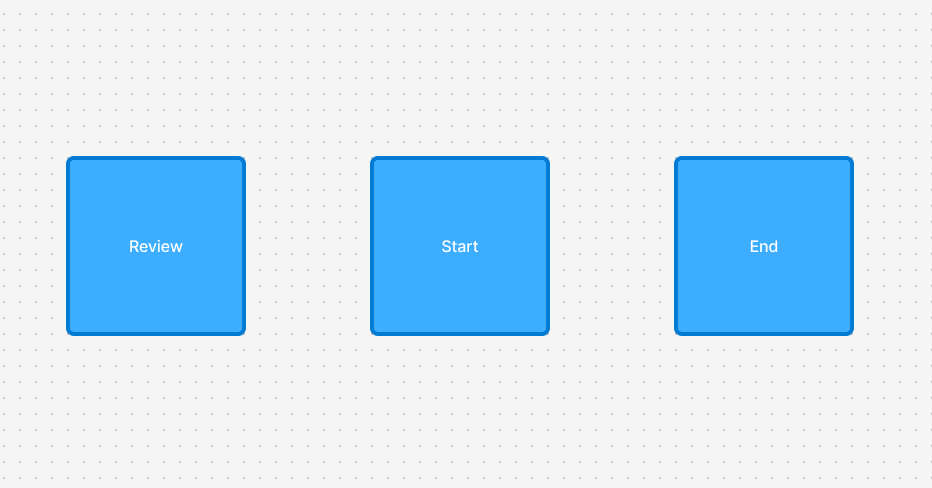

# Format shapes in FigJam

## Introduction

This task will show you how to insert and format shapes in FigJam. You will create a small practice area by adding a shape, changing its appearance, and labeling it with text. After you complete this task, you will be ready to build a simple flowchart in FigJam.

## Procedure

1. **Click** **New FigJam board** from the Figma home page (top right corner).

This opens a blank FigJam board where you can add shapes, text, and connectors.

!!! success
    You should see a large blank board in the middle of the screen.

!!! note
    If a pop-up appears when the board opens, close it before continuing.

2. **Click** the **Shape** tool in the toolbar and **select** a rectangle.

The Shape tool lets you place visual objects on the board. A rectangle is a good first shape because it is commonly used for process steps.

!!! success
    Your cursor should now be ready to draw a rectangle.

3. **Drag the rectangle** onto the board and click to place it.

Drawing the shape gives you an object that you can format and label. The exact size does not need to match perfectly.

!!! success
    You should see one rectangle on the board.

4. **Click** the rectangle, then **change** the **Fill** color and **Stroke** color or thickness in the formatting options.

Changing the fill and stroke makes the shape easier to see and helps organize information visually. For example, you can use one color for important steps and another color for supporting steps.

!!! success
    Your rectangle should now look different from the default shape.

!!! warning
    Make sure the text and shape colors still contrast clearly. Light text on a light shape can become hard to read.

5. **Double-click** inside the rectangle, **type** `Review`, then **copy and paste** the shape twice (ctrl+c and ctrl+v). **Move** the copies beside the first shape and **rename** them `Start` and `End`.

Adding text turns the shape into a labeled object that a reader can understand. Duplicating the shape saves time and keeps the formatting consistent across your board.

!!! success
    You should now see three labeled shapes on the board.

## Conclusion

You have created and formatted shapes in FigJam by inserting a rectangle, changing its appearance, and adding text. You also duplicated the shape to create a small set of matching objects. In the next task, you will use these same skills to build your first flowchart.

For help with display or formatting issues, see [Troubleshooting](troubleshooting.md).
