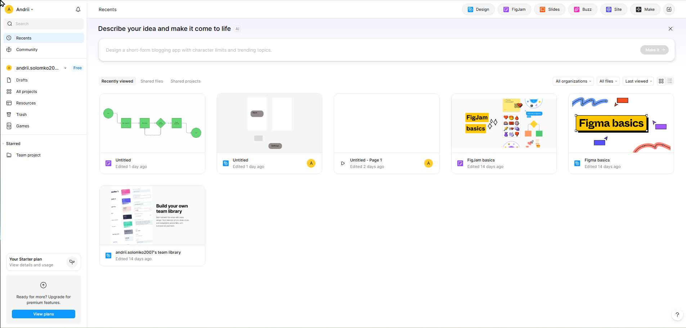
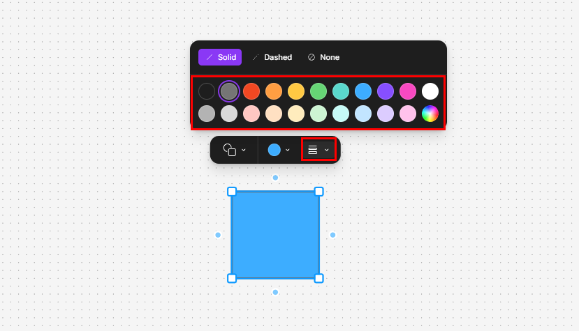
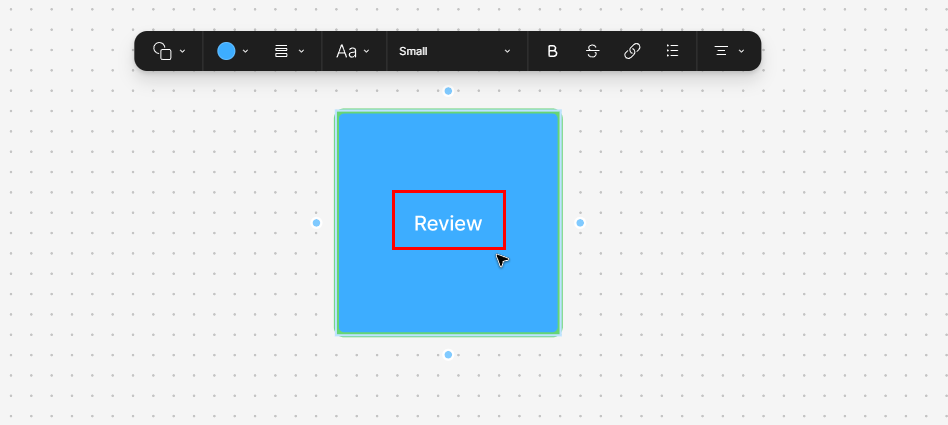
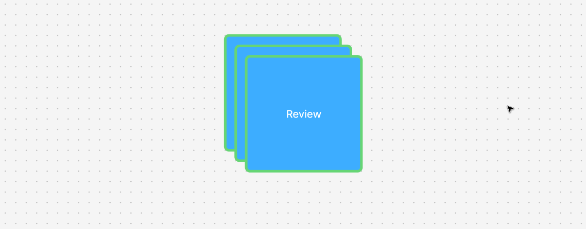
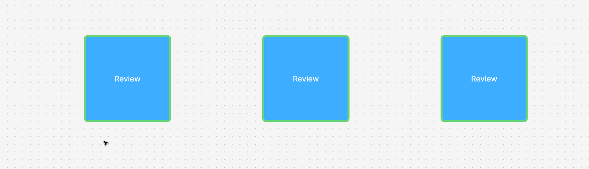
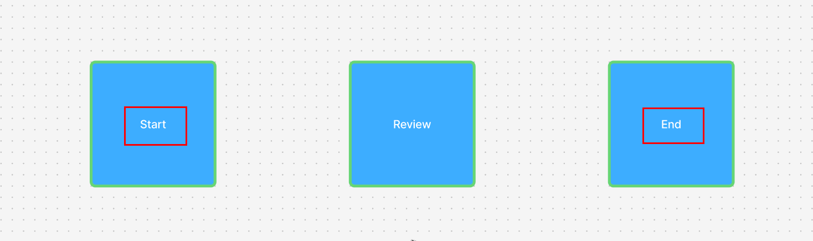

# Format shapes in FigJam

## Introduction

This task will show you how to insert and format shapes in FigJam. You will create a small practice area by adding a shape, changing its appearance, and labeling it with text. After you complete this task, you will be ready to build a simple flowchart in FigJam.

!!! warning
    Before beginning this task, ensure you are on the main page of Figma just after signing up or signing in.

## Procedure

Step 1: **Click** "FigJam" near the top right of the Figma home page.

This opens a blank FigJam board where you can add shapes, text, and connectors.

!!! success
    You should see a large blank board in the middle of the screen.

!!! note
    If a pop-up appears when the board opens, close it before continuing.

Step 2: **Click** the shape tool in the bottom toolbar and **select** the square.

The shape tool lets you place visual objects on the board. A square is a good first shape because it is commonly used for process steps.

!!! success
    Your cursor should now be ready to draw a square.

Step 3: **Click and drag** the square from the bottom toolbar onto the board and **let go** to place it.

Drawing the shape gives you an object that you can format and label. The exact size does not need to match perfectly.

!!! success
    You should see one square on the board.

Step 4: **Click** the square to select it, then **click** the colored circle in the bar that appears above.

This menu allows you to modify the color of the shape.

!!! success
    You should see a small color selection menu pop up.

Step 5: **Choose** one of the preset color circles and **click** it.

Changing the fill makes the shape easier to see and helps organize information visually. For example, you can use one color for important steps and another color for supporting steps.

!!! success
    The fill color of your square should now be the color you selected.

Step 6: **Click** the three line icon to the immediate right of the colored circle, and **chose** a color different to your fill color.

This will change your stroke color (the outside line), which allows for further organization, and can represent more specific subcategories.

!!! success
    The thin line surrounding your square should now be the color you selected

!!! note
    The stroke thickness can also be adjusted in the same menu as the stroke color.

!!! warning
    Make sure the text and shape colors still contrast clearly. Light text on a light shape can become hard to read.

Step 7: **Double-click** inside the square and **type** `Review`.

Adding text turns the shape into a labeled object that a reader can understand.

!!! success
    Your square should now be labeled "Review".

Step 8: **Select** the square, then **press** Ctrl+C, then **press** Ctrl+V twice.

Duplicating the shape saves time and keeps the formatting consistent across your board.

!!! success
    You should see two new squares, identical to yours get, added mostly overtop of your intial square.

Step 9: **Separate** the three squares by **clicking and dragging** them apart.

Separating the shapes gives us easier access to each one, and is more visually pleasing.

!!! success
    The three squares should not be overlapping at all.

Step 10: **Double-click** on one of the shapes and **rename** it `Start`, then **rename** a second square to `End`.

Renaming duplicated objects helps create distinct, but consistent elements.

!!! success
    You should see three squares named: "Start", "Review", and "End".

## Conclusion

You have created and formatted shapes in FigJam by inserting a rectangle, changing its appearance, and adding text. You also duplicated the shape to create a small set of matching objects. In the next task, you will use these same skills to build your first flowchart.

For help with display or formatting issues, see [Troubleshooting](../troubleshooting.md).
