# Basic formatting in Figma Design

## Introduction

This task will teach how to perform basic actions in Figma Design, that you will need to later build your first wireframe. Before beggining this task, ensure you are on the main page of Figma just after signing up or signing in.

## Procedure

Step 1: **Click** on "Design" near the top right.

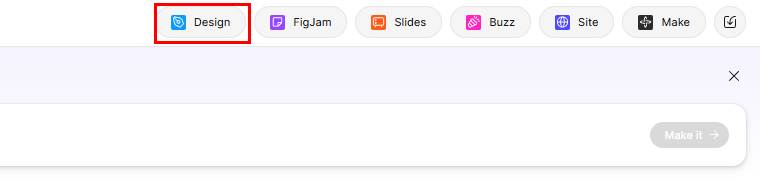

This will create a new Figma Design file for you to work with.

!!! success
    You should see an empty middle area, two thick sidebars and a small bottom row.

!!! note
    If you see a pop up on the left side of the screen, close it using the x in the top right corner of the popup before proceeding.

Step 2: **Click** the square in the bottom row (**do not click** the dropdown arrow beside it).

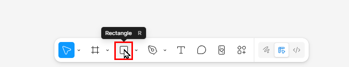

This will select the rectangle tool, which will allow you to draw basic rectangles.

!!! success
    The square you clicked should now have a blue background, signifying that it's selected.

Step 3: **Hold down** left click, while **hovering** over the grey background and **drag** your mouse down and right until the numbers underneath the rectangle read approx. 300 x 150, then **let go** of left click.

!!! note
    The exact dimensions don't matter in this case.

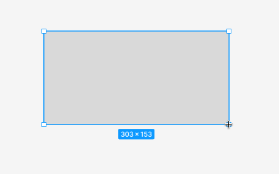

This has created a rectangle on your file for you to work with.

!!! success
    You should see a grey rectangle on your screen.

Step 4: **Click** the grey square below "Fill" on the right sidebar.

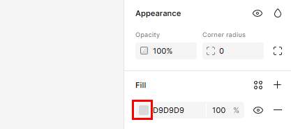

This will bring up the color selection menu.

!!! success
    You should see a multicolored menu pop up next to the right sidebar.

Step 5: **Move** your mouse cursor near the middle of the left side of the multi-color square and **left click** (make sure to **click** within the color square and not outside it), then **close** the menu.

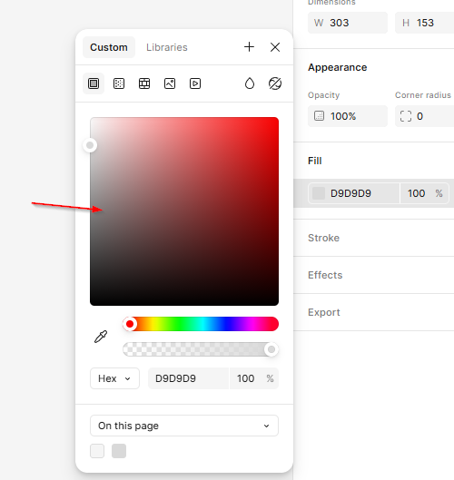

This will change the color of your currently selected shape, for now just to make it easier to see.

!!! success
    Your rectangle should now be a darker shade of grey than before.

Step 6: **Select** the rectangle and **hover** over it. **Go to** one of the circles inside the rectangle near the corner , **click and drag** inward until you see "Radius 40".

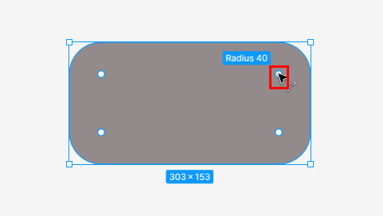

This makes your rectangle rounded, which will help create shapes that look like buttons or screens instead of basic rectangles.

!!! success
    Your rectangle should now have round edges instead of regular sharp edges.

Step 7: **Click** on the number right of "W" under dimensions on the right panel and type in 200, press enter.

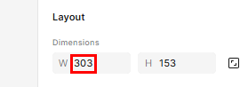

This will set the width of your rectangle to 200.

!!! success
    Your rectangle's width should shrink after you entered the value.

Step 8: **Click** on the number right of "H" under dimensions on the right panel and type in 100, press enter.

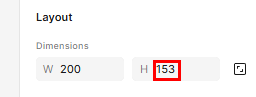

This will set the height of your rectangle to 100.

!!! success
    Your rectangle's height should shrink after you entered the value.

Step 9: **Click** on the text icon in the bottom row.

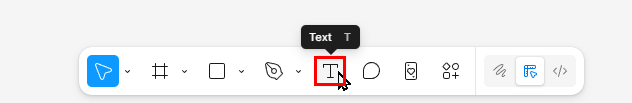

This will allow you to create text boxes.

!!! success
    The text icon you clicked should now have a blue background, signifying that it's selected.

Step 10: **Click and hold** inside your rectangle near the top left corner and **drag** towards the bottom right corner until the numbers below read approx. 150 x 50, then let go.

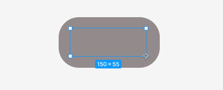

This will create a text box on top of your shape, allowing you to add and modify text inside of it.

!!! success
    There should be a blue rectangular outline inside of your rounded rectangle.

Step 11: **Click** on the number 12 in the typography section of the right sidebar, **type in** 30, press enter.

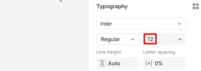

This will change the font of any text you add to 30.

!!! success
    The caret in the text box should be larger now.

Step 12: **Type in** `Settings` and **click** off the text box.

This can be used to give the shape a name, allowing for easier reference and identification.

!!! success
    Your rounded rectangle should now be labeled "Settings".

Step 13: **Click and hold** outside of the shape, then **drag** the mouse across the shape and text box, then **let go**.

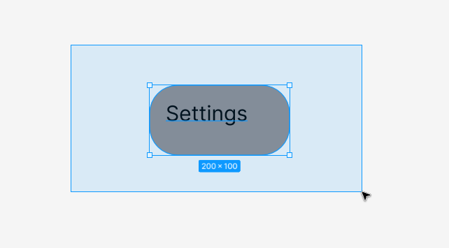

This selects both the shape itself, and text you added.

!!! success
    The rounded rectangle should have a blue outline, and "Settings" should have a blue underline.

Step 14: **Right click** on the selected objects and **click** on "Group selection".

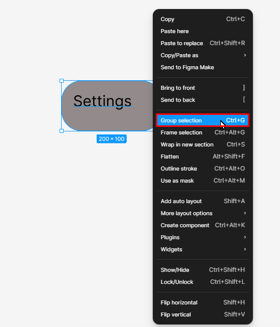

This combines the selected objects, so they can be moved together.

!!! success
    Now you should be able to drag the shapes around the file, and they will stay together.

## Conclusion

From this task you've essentially created a button. You know how to draw a shape, change its color, change its dimensions, and add text. From here you can move on to creating your first clickable wireframe.
