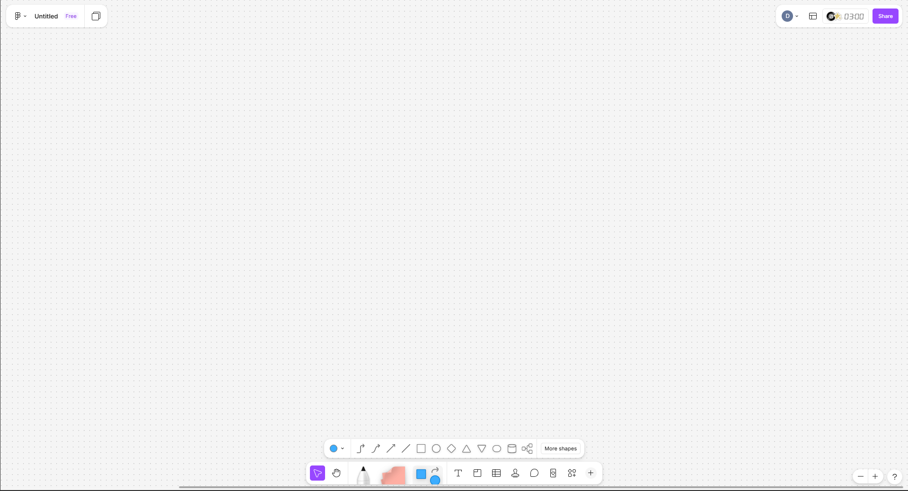
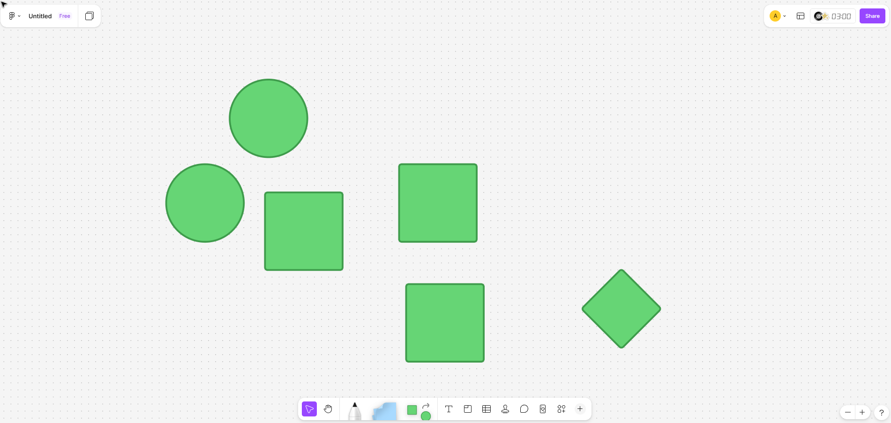
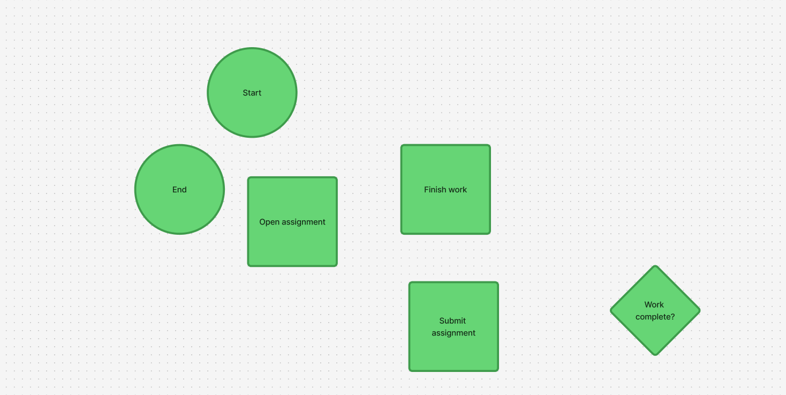
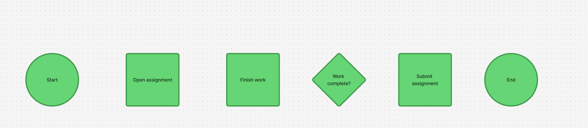
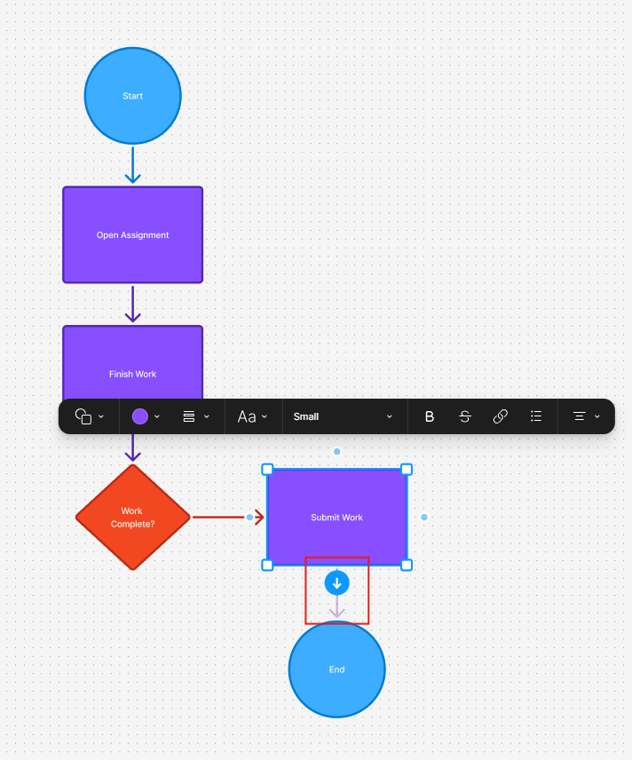
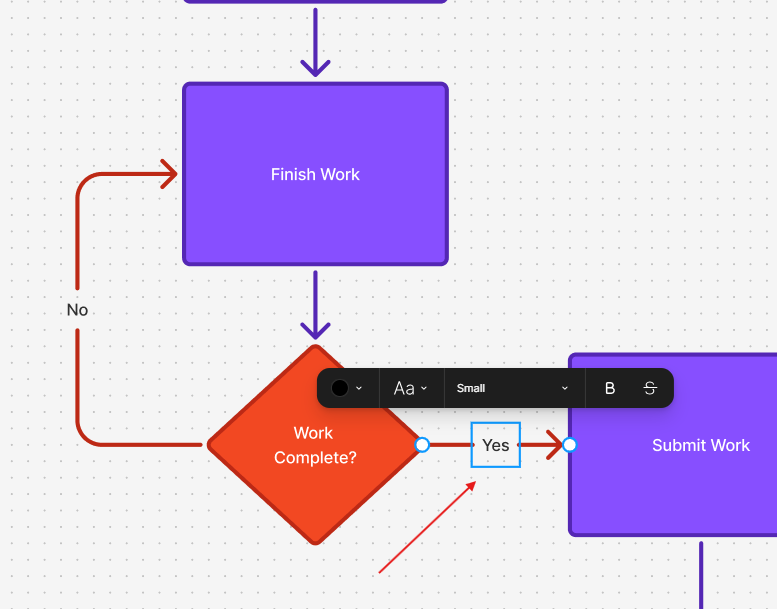
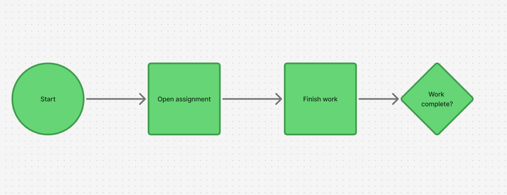
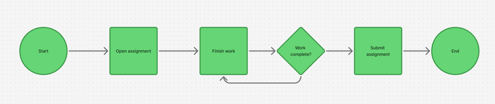
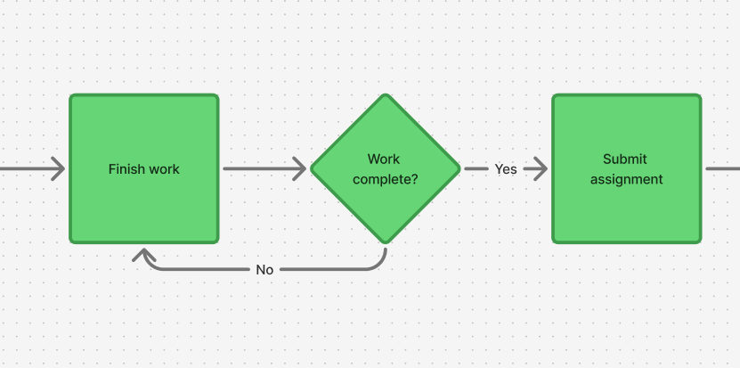
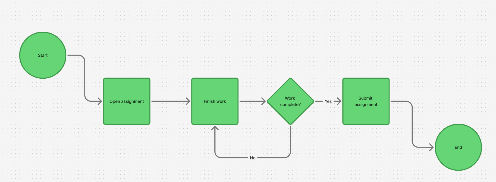

# Create your first flowchart in FigJam

## Introduction

This task will show you how to create a simple flowchart in FigJam. You will place shapes, label each step, and connect them in the correct order to show how a process works. After you complete this task, you will have a finished beginner flowchart that you can use as a model for future diagrams.

!!! warning
    Before begininng this task, ensure you are on the main page of Figma.

## Procedure

Step 1: **Open** a blank FigJam board or continue on an empty area of your existing board.

Starting with a clear area makes it easier to organize the flowchart and prevents shapes from overlapping with other content.

!!! success
    You should have enough empty space to place several shapes vertically.

Step 2: Using the shape selection menu, add two circles, three squares, and a diamond.

These shapes will represent the core structure of a flowchart. Squares/rectangles for a process, and diamonds for a deicision.

!!! success
    You should have three squares, two circles, and a diamond on your FigJam board.

Step 3: **Double-click** each shape and **type** its labels. Circles: `Start` and `End`. Squares: `Open assignment`, `Finish work`, and `Submit assignment`. Diamond: `Work complete?`.

Labels explain what each step means. Without labels, the reader can see the shapes but cannot understand the process.

!!! success
    Every shape should now contain short, readable text.

Step 4: **Move** the shapes into order from top to bottom. Place "Start", "Open assignment", "Finish work", "Work complete?", "Submit assignment", and "End" in one horizontal line from left to right in that order.

!!! warning
    Ensure that the shapes aren't cramped together and are spaced out enough that you can fit another shape inbetween them, without overap.

A clear layout helps the reader follow the process from beginning to end. Placing the decision in the middle makes the branch easier to understand.

!!! success
    The shapes should be organized left to right in the following order: "Start", "Open assignment", "Finish work", "Work complete?", "Submit assignment", and "End".

Step 5: **Click** the bent connector tool icon which is on the left side of the shape selection bar.

Using this tool will allow for bent but not curved connections between our shapes. Which is the prefered method for flowcharts.

!!! success
    The bent connector icon in the shape selection bar should now have a black outline.

Step 6: **Connect** "Start" to "Open assignment" by hovering over the right-most point of "Start", then **clicking and dragging** it to the left side of "Open assignment".

Connecting the steps in a flowchart in the correct order and direction is vital, as these connectors show how the user moves through the process.

!!! success
    There should be a long arrow pointing from the bottom of "Start" to the top of "Open assignment".

!!! note
    Once two shapes are properly connected, moving one will also modify the path of the connector to ensure that it still points to its target shape.

Step 7: **Repeat** Step 6 to connect the rest of the shapes in this order: "Start" → "Open assignment" → "Finish work" → "Work complete?".

Connecting processes without desicions will always result in a straight line, following the arrows without having to chose a direction.

!!! success
    You should see the following connection structure: "Start" → "Open assignment" → "Finish work" → "Work complete?"

Step 8: Connect "Work complete?" to "Submit assignment" and "Finish work", then connect "Submit assignment" to "End".

Adding a split path at a desicion diamond is the main benefit of a flowchart, allowing you to follow a process that can make decisions, instead of just linear execution.

!!! success
    You should see the following added connections: "Work complete?" → "Submit assignment", "Work complete?" → "Finish work", and "Submit assignment?" → "End".

!!! warning
    Check that each arrow points to the correct next step. One connector in the wrong direction can change the meaning of the entire flowchart.

Step 9: **Double-click** on the connector between "Work complete?" and "Submit assignment" and label it `Yes`, then label the connector between "Work complete?" and "Finish work" `No`.

Labeling connectors at a fork shows what the decision correlates to which path for the program or procedure to take.

!!! success
    The two connectors going out of "Work complete?" should be labeled "Yes" and "No".

Step 10: Align the shapes and connectors to make the flowchart easier to read.

Ensuring the chart is alligned makes it cleaner and more professional.

!!! success
    Your finished flowchart should be neat, readable, and fully connected.

## Conclusion

You have created your first flowchart in FigJam by placing shapes, adding labels, and connecting each step in order. This type of diagram is useful for showing how a process works and where decisions change the path. You can now use the same method to build more detailed flowcharts for class, planning, or group work.

For help with missing connectors, overlapping shapes, or unreadable labels, see [Troubleshooting](../troubleshooting.md).
