# Your first wireframe in Figma Design

## Introduction

This task will show you how to create a basic wireframe in Figma Design, building on what you created in Task 3. Once you know how to make a small wireframe, you can make any wireframe with the same tools.
!!! warning
    Before beggining this task, ensure you are in the file that contains your work from Task 3.

## Procedure

Step 1: **Click** "File" near the top of the left sidebar.

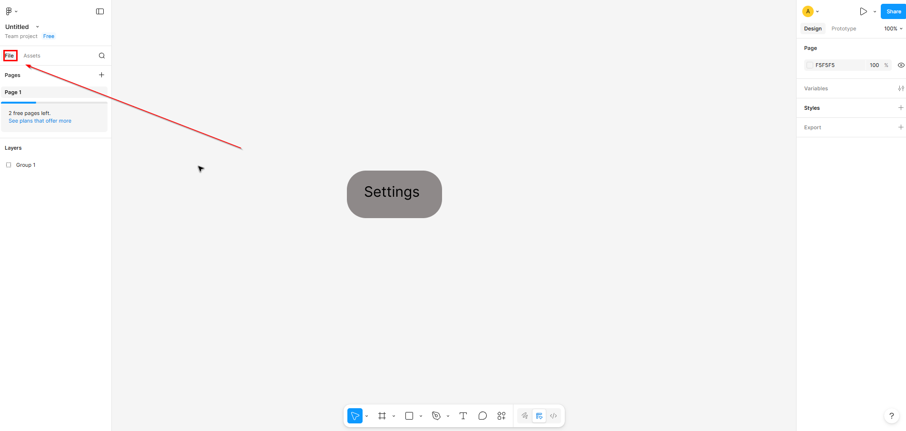

This ensures you can see all the layers in the file, and allows you to select specific shapes, without clicking them directly.

!!! success
    You should be able to see the "Layers" section and within there should be "Group 1", "Settings", and "Rectangle 1".

Step 2: **Click** on your grouped shape and **press** Ctrl+C, then **press** Ctrl+V.

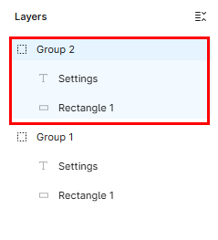

This will copy your object and paste an identical version on top of it.

!!! success
    You should now see a "Group 2" in layers, the contains the same elements as "Group 1".

Step 3: **Click and hold** on your object, then **drag** it just left of the original object.

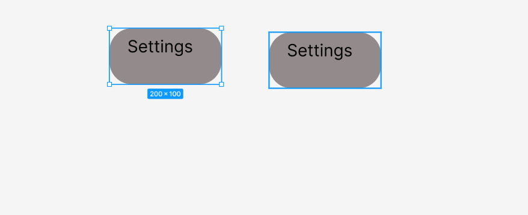

This will separate the two objects and ensure you can easily interact with either of them.

!!! success
    You should see two identical rounded rectangles, labeled "Settings", side by side.

Step 4: **Click** on "Settings" in "Layers" under "Group 2" in the left sidebar.

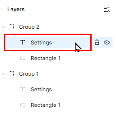

This will select the text box inside its group, and allow you to modify it.

!!! success
    The text box in the left object should have a blue outline, and the text should be underlined.

Step 5: **Double-click** the underlined text in your left rectangle, type in `Back`, and **click off**.

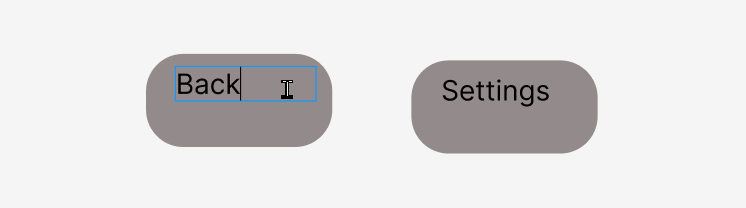

This changes the text of the second object, giving them distinct names.

!!! success
    You should now have a "Settings" shape, and a "Back" shape.

Step 6: **Select** the frame tool in the bottom row.

This tool will allow you to create frames. These will represent the base of a UI, like a phone or computer screen.

!!! success
    The square you clicked should now have a blue background, signifying that it's selected.

Step 7: **Move** your rectangles upward by **scrolling down** until they are near the top of the screen.

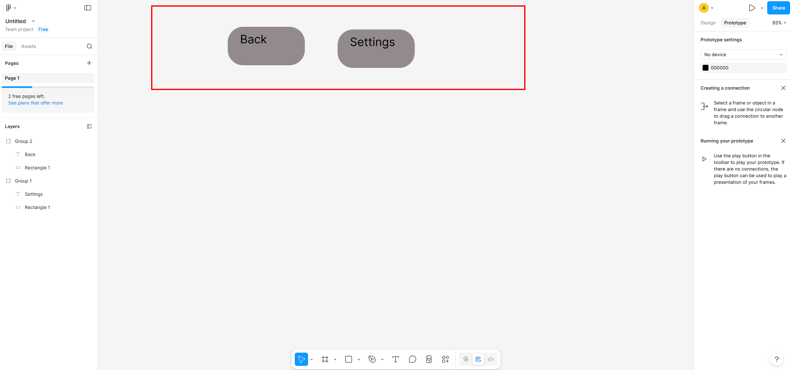

This gives us some space to create the frames.

!!! success
    Your "Settings" and "Back" rectangles should be near the top of the screen.

Step 8: **Draw** a frame underneath the "Back" rectangle with dimensions approx. 300 x 500 just as you drew the rectangle in task 3.

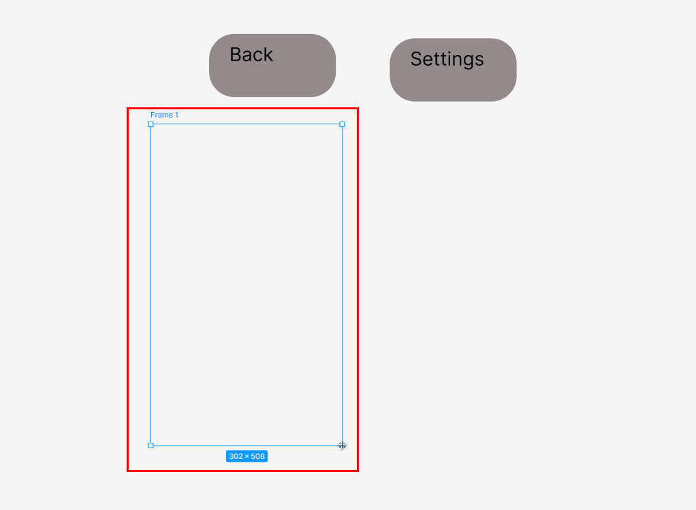

This frame is a crucial part of creating a clickable wireframe in Figma Design, as it represents a UI screen, to which we can attach text and buttons.

!!! success
    You should see a large, white vertical rectangle below your "Back" shape and a "Frame 1" layer in "Layers".

Step 9: **Copy and paste** the frame like you did with the "Settings" rectangle in Step 2.

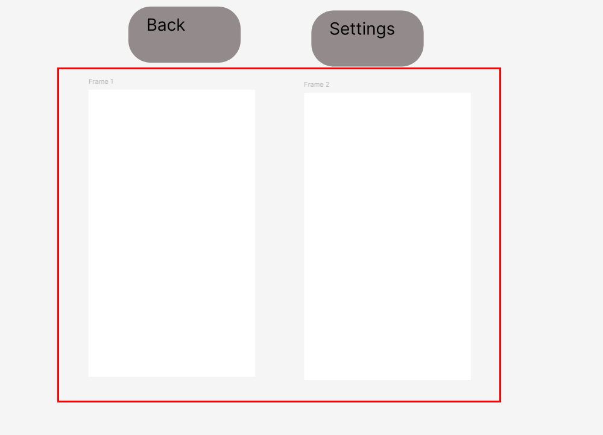

This will create a second frame, which we can later link together.

!!! success
    You should see two identical large, white rectangles.

Step 10: **Drag** your "Back" rectangle into the middle of "Frame 1".

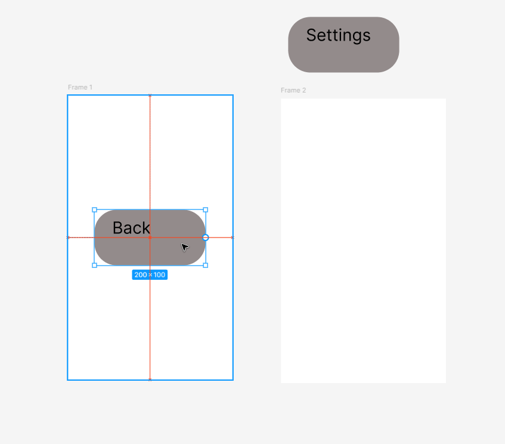

This will add the "Back" shape to the static view of the first frame.

!!! success
    The "Back" shape should be visibly in front of "Frame 1".

Step 11: **Drag** your "Settings" shape into "Frame 2".

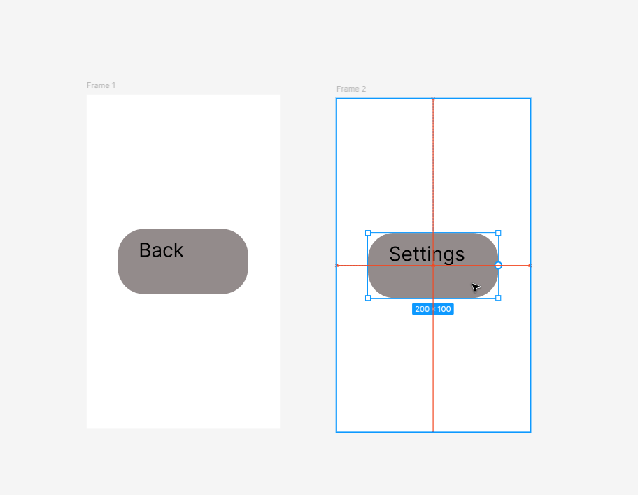

This will add the "Settings" shape to the static view of the second frame.

!!! success
    The "Settings" shape should be visibly in front of "Frame 2".

Step 12: **Click** on "Prototype" at the top of the right sidebar.

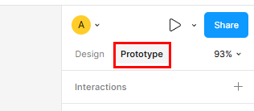

This is what will allow you to link the frames together.

!!! success
    You should see "Creating a connection" and "Running your prototype" on the right sidebar

Step 13: **Hover over** the "Settings" shape and move your mouse to the middle of the left side of the blue outline of the shape.

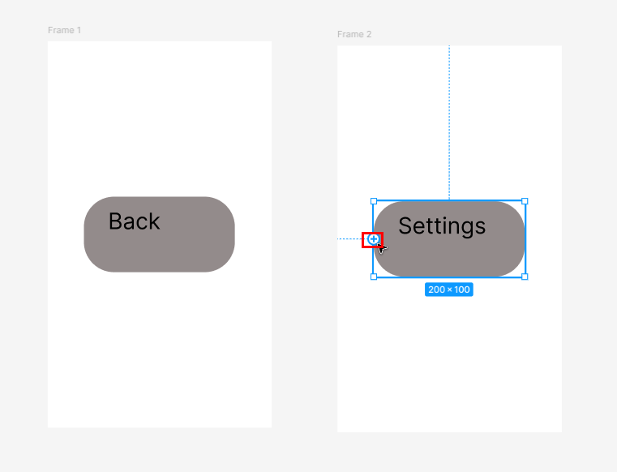

This will give you the ability to link the shapes together by dragging a line to another frame.

!! success
    Under your mouse cursor, you should see a small blue cross in a blue circle.

Step 14: **Click** on the cross, **hold and drag** the mouse to "Frame 1", **let go** when "Frame 1" has a blue outline and **close** the pop-up.

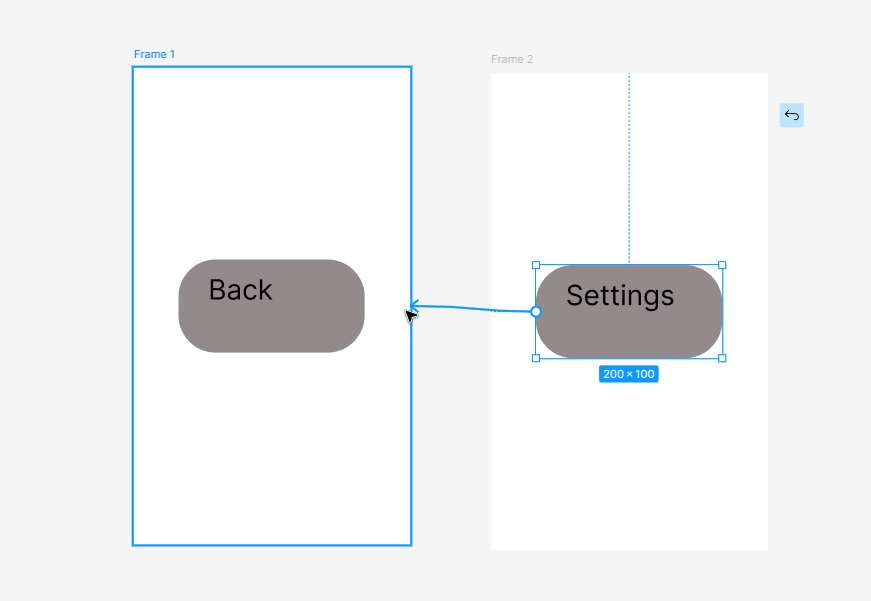

This will link the "Settings" rectangle to "Frame 1".

!!! success
    There should now be a light blue line from "Settings" to "Frame 1".

!!! note
    The pop-up that appeared can be used to customize the details of the interaction.

Step 15: **Link** "Back" to "Frame 2" in the same way as you did in Steps 13-14.

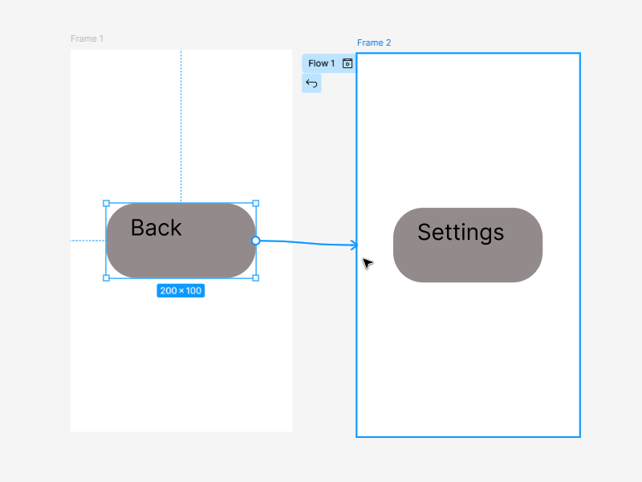

This links "Back" to "Frame 1" creating a connection loop between the two frames.

!!! success
    There should now be a light blue line from "Back" to "Frame 2".

!!! note
    The light blue connecting lines will only be seen while in the "Prototype" section of the right sidebar. If you switch back to "Design", they will be visually absent.

Step 16: **Click** on the Play Icon at the top of the right sidebar.

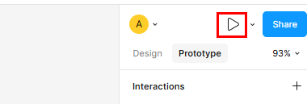

This will open a dynamic interaction prototype of your wireframe.

!!! success
    You should be redirected to another tab in your browser and see one of your frames.

Step 17: **Click** the labeled button in the frame to switch to the next frame, and **click** again to return to the first frame.

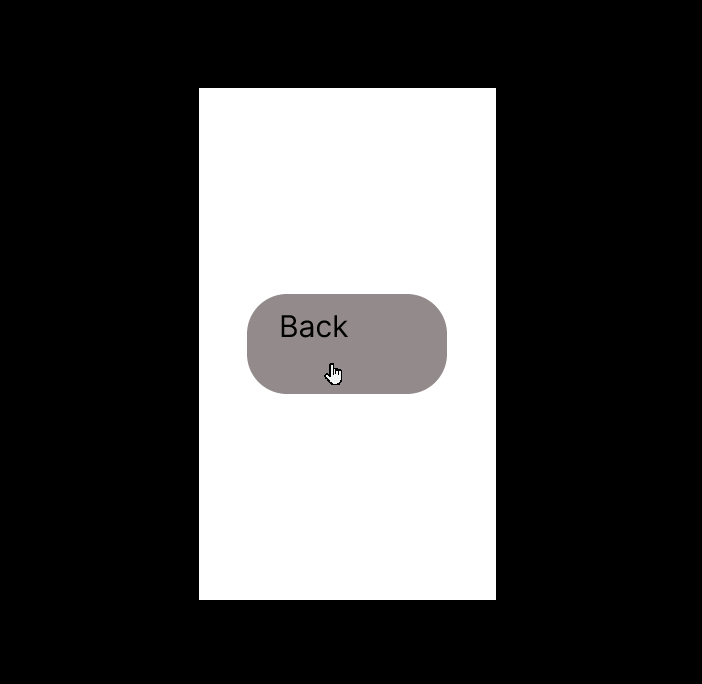

Explanation of step
This demonstrates a basic wireframe with buttons to switch screens or tabs.

!!! success
    Clicking on the buttons should switch your view to the other frame, in a loop.

## Conclusion

You now know how to use shapes, frames, and links to create a fully functional wireframe. The one you just made is very simple, but it can serve as a starting point for a wireframe of any size.
